# COMP3170 Assignment 1  – Tank Adventure
## Topics covered:
* 2D mesh construction
* HSB and RGB colour spaces
* 2D transformations: rotation, translation, scale
* Animation
* Scene graph
* Coordinate frames
* 2D camera: view and projection matrices, aspect
* Instancing

## ULOs
* ULO1: Understand the fundamentals of vector geometry and employ them in devising algorithms to achieve a variety of graphic effects.
* ULO2: Program 2D and 3D graphical applications using OpenGL embedded in a programming language (such as OpenGL in Java).

## Task Description
Your task is to implement a top-down scene with a desert environment. Rocks and cacti litter the land (Figure 1). A tank rolls over the scene, controlled by the keyboard.

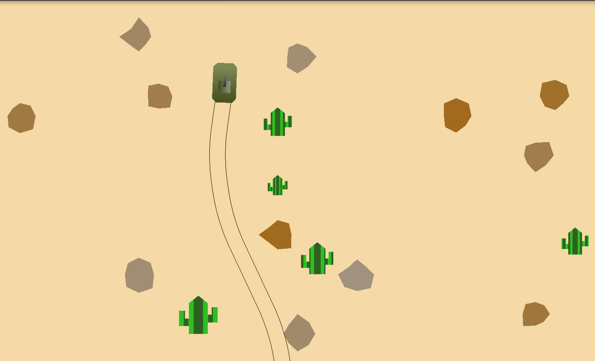 

## Framework
For this assignment, you will need the COMP3170 LWJGL library that we have been using in the workshop classes. See the Week 1 workshop for how to download and install this library. Make sure to pull the latest version of the library from the repository before beginning the project.

This repo is the assignment. Inside this repo, you will find a Java project with the following files:
* `Assignment1.java` – The “bare-bones” driver class for the project.
* `Scene.java` – an example of a Scene class.
* `Tank.java` – an example of a class using the SceneObject class.
* `simple_vertex.glsl / simple_fragment.glsl` – a basic, simple shader.

To complete the assignment, you will need to edit these files and add further classes (and shaders) of your own.

The repo also contains a Report template and folders for images.

## Features
You are required to complete each of the features below. Note that not all features are of equal difficulty.

Note: In the spec, some specific numbers (e.g. the colour and size of the tank, etc) are not specified. You are free to choose whatever values you feel appropriate for these as long as they illustrate the behaviour required. However, remember to use named constants in your code (with comments to indicate units) to allow these values to be easily modified. Clarity marks will be deducted for using ‘magic numbers’ (embedded numerical constants given without explanation). 

## General Requirements
You should use the SceneGraph implementation provided in the comp3170.lwjgl project to organise the objects in your scene.

Throughout this document, we will refer to “world units”. A world unit is defined as a single unit of world space. For example, an object with the following Model to World Matrix:

|i|j|k|T|
|-|-|-|-|
|2|0|0|2|
|0|2|0|3|
|0|0|1|0|
|0|0|0|1|

Is 2 world units in width and height, and positioned at coordinate (2,3) in world space. You can think of 1 world unit as equivalent to 1 metre.

### Cactus – Mesh (4%)
Create a cactus mesh with two branches. The cactus should be at least 1 world unit tall.

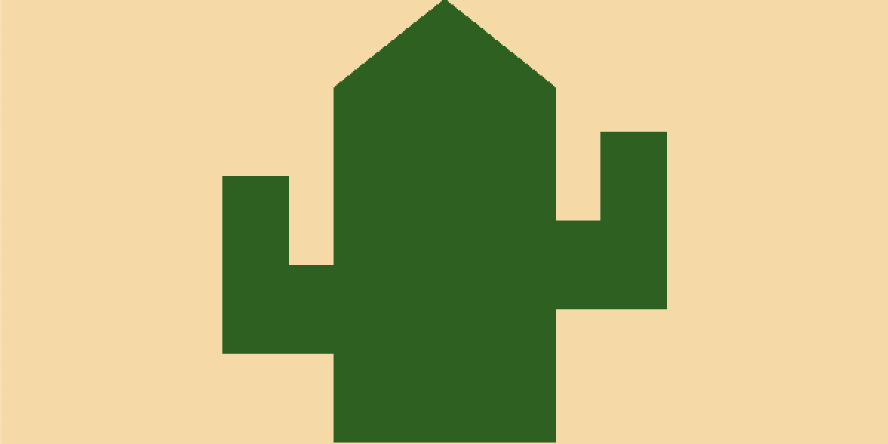

### Cacti field (4%)
Clear the background to a brownish, desert colour. Randomly position 1000 cacti throughout a 200x500 area of world units, as shown in Figure 5. Cacti should vary between 1 and 2 world units in height, with proportionate width.

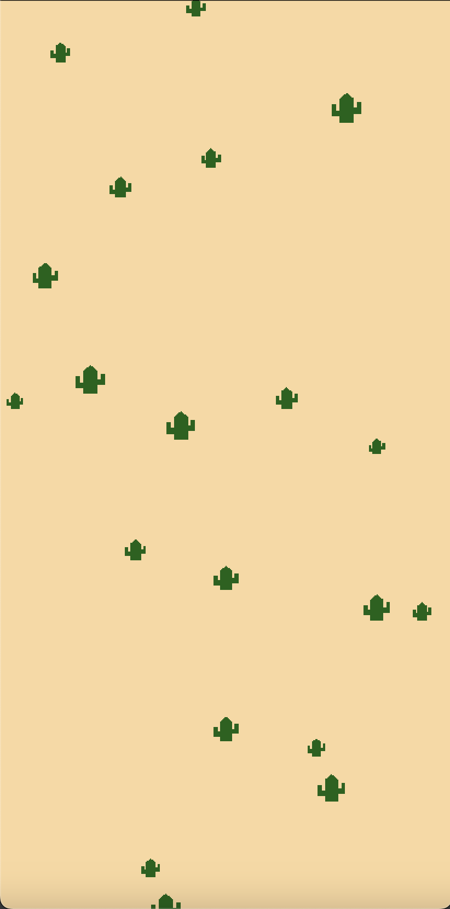

### Rocky terrain (8%)
Randomly position 1000 rocks around the 200x500 area of world units.

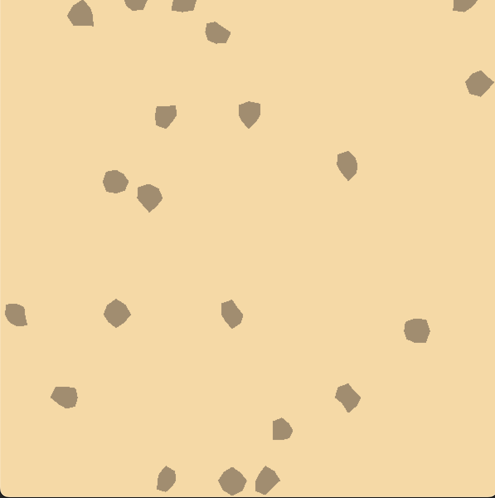

Each rock is an irregular polygon. Each vertex should be between 0.5 and 1.0 units from the rock's centre in local space. The angle 𝜃 between successive vertices (measured from the centre of the rock) should always be less than 90 degrees. See below for an example mesh drawing (you should create your own in your report reflective of your work):

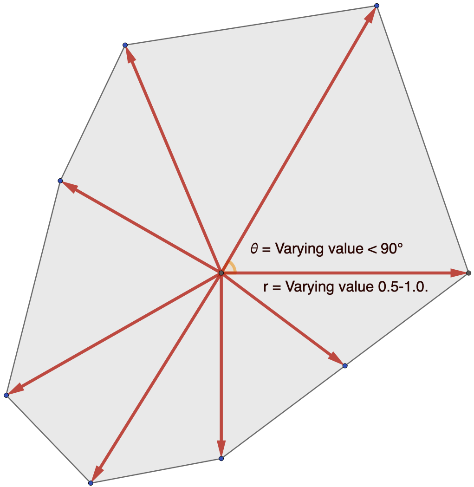

### Rocks - Colour (4%)
Rock colour should be set to a hue of your choice, with a randomly chosen saturation and brightness value ranging from 0% to 100% in HSB space.

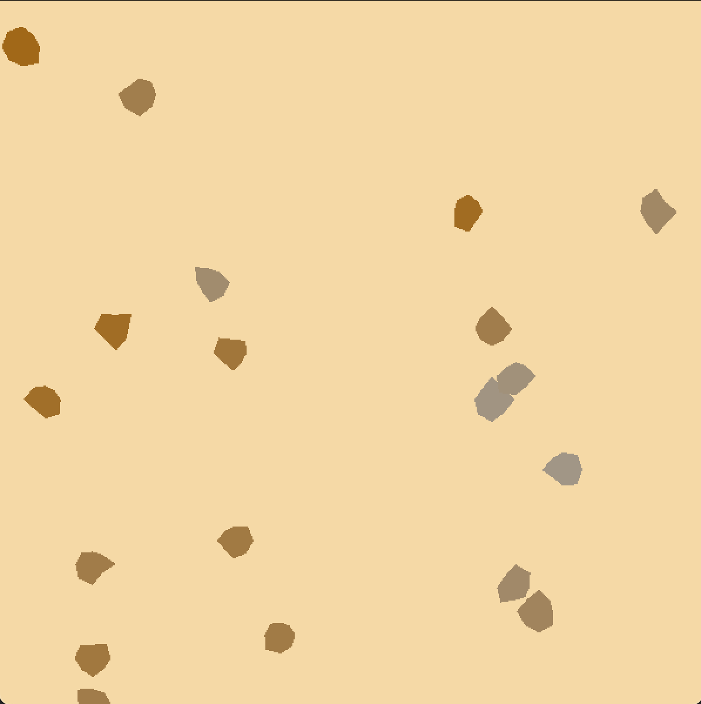

### Tank – Mesh (8%)
Create a mesh of a Tank with a hull (colour of your choice, octagonal in shape), a turret (colour of your choice, rectangular in shape) and a gun (colour of your choice, rectangular in shape). You may add more detail to this tank if you like, but remember to keep the basic shape legible for marking.

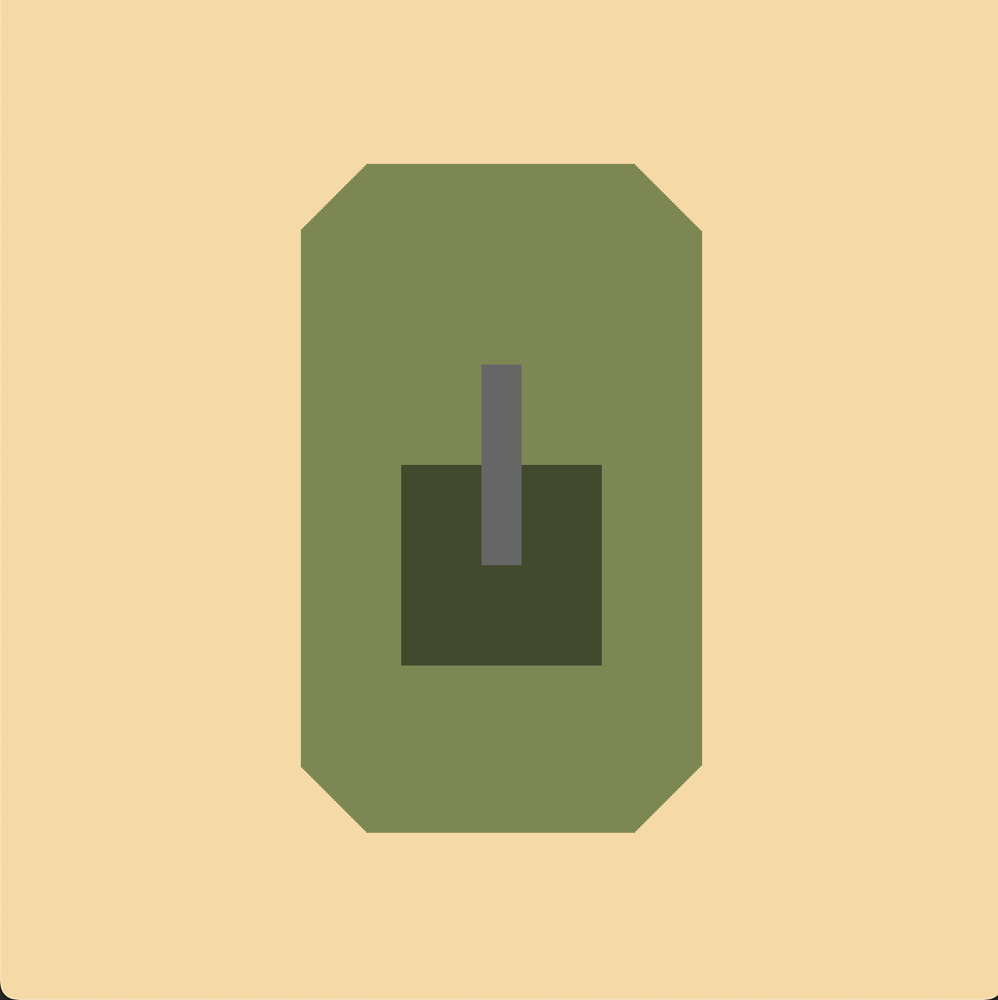

### Tank – Vertex colouring (4%)
Use vertex colouring to have the Tank components’ colouring change per vertex.

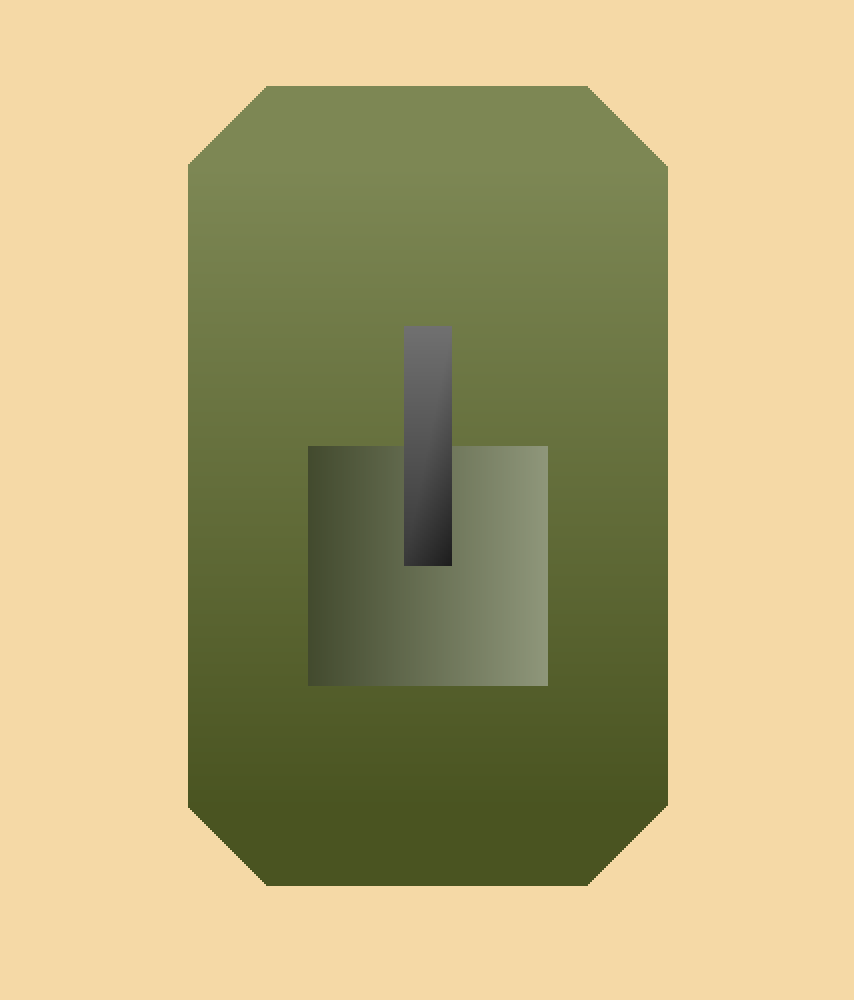

### Tank – Animation/Movement (4%)
The Tank can move forward in local space at a set speed when the `W` key is pressed. 

If the tank is moving forward, pressing the `A` key will rotate the tank at a set rate to the left in local space, and pressing `D` will rotate the tank at a set rate to the right in local space.

### Tank – Turret movement and gun scale (4%)
The turret can rotate 360 degrees left and right in local space. The gun can be scaled along its y axis to a minimum/maximum change of 3x of its original length. Rotation and scaling adhere to the following keyboard input:

|Input|Action|
|-|-|
|Up arrow | Increase gun length |
|Down arrow | Decrease gun length |
|Left arrow | Rotate turret left |
| Right arrow | Rotate turret right |

<video src="ExampleImages/tankmovement.mov" width="320" height="240" controls></video>

### World camera (4%)
Create a camera that follows the tank. The camera remains stationary, except for if the tank's mesh reaches the top or bottom quarters of the view, in which case the camera should move with it. The camera should remain aligned with the world X/Y coordinates and should not rotate.

## World camera – resizing (8%)
The view volume of the camera should be adjusted proportional to the size of the window, with scaling along the x axis. 

A 600x600 window should show a 30x30 area of world space. Making the window’s height larger (or shorter) should reveal more (or less) of the world without changing the screen size of objects displayed. Making the window wider (or narrower) should scale objects.

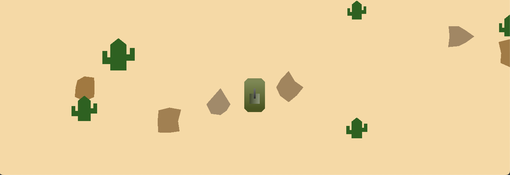
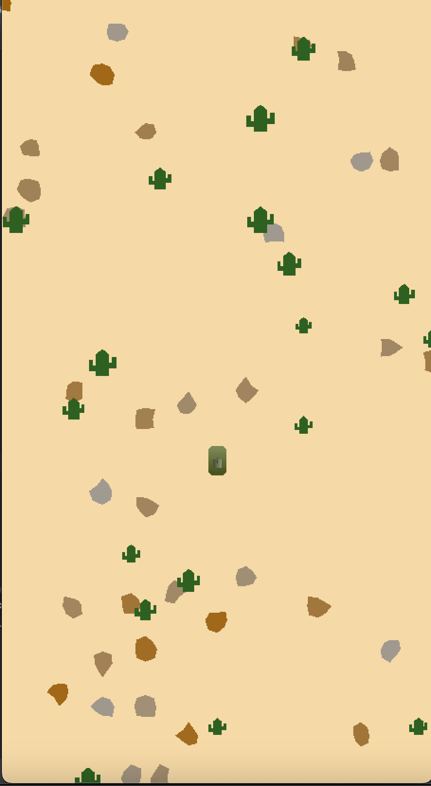

### Turret camera (4%)
Another camera, which is 3x as zoomed in as the main camera, follows the tank’s turret. This camera rotates to orient itself around the turret's z-axis, and moves to keep the turret in its centre. It adheres to the same scaling rules as the world camera.

Pressing '2' switches the current view to the turret camera. Pressing '1' switches back to the world camera.

<video src="ExampleImages/turretcam.mov" width="320" height="240" controls></video>

## Distinction and HD level tasks
The above tasks are enough for you to earn a Credit (with credit-level effort/skill applied, and assuming completed documentation). The below tasks are more challenging, and should only be attempted by students aiming for Distinction and HD marks. We recommend completing the above tasks first before attempting these.

### Instancing (8%)
Implement the cacti using instancing so all the cacti are drawn in a single draw call.

### Tread marks (8%)
As the tank moves across the field, it leaves tread marks behind it that show its movement. The tread marks are black, and are shown as simple lines.

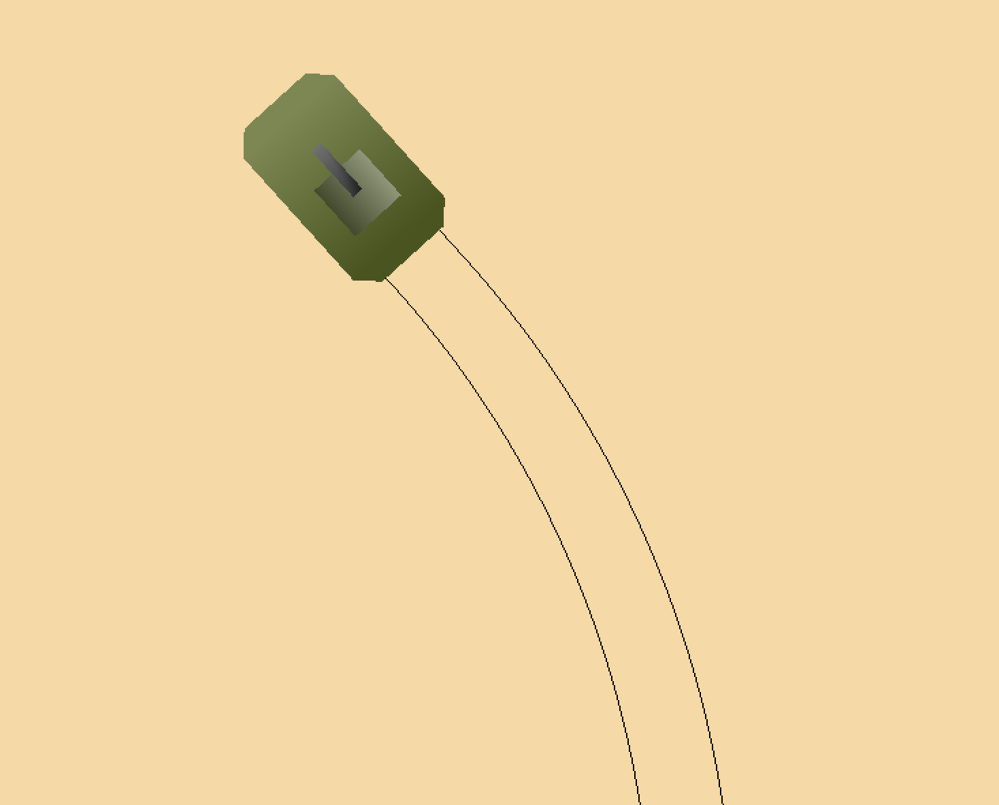

### Cacti colour bands (8%)
The cacti feature bands of another shade running along its length.

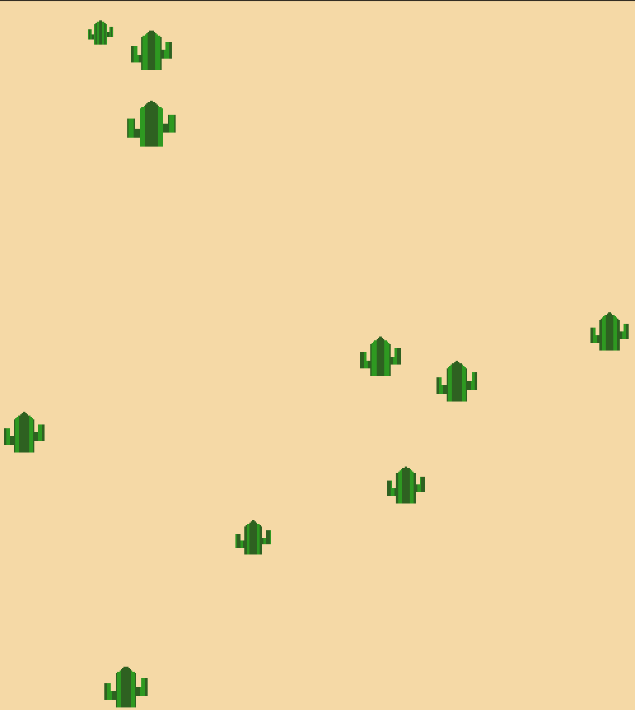 

## Documentation
In addition to your code, you should complete the `Report.md` file found at the top level of this repo, addressing all questions. The documentation is worth 20 marks, with this breakdown detailed in the rubric below and the `Report.md` file itself. Images can be placed in the 'ReportImages' folder, also located at the top level of this repo. See `Report.md` for a description of each of these tasks.

Please use a ruler when drawing, and ensure your drawings are clear. Marks may be deducted for messy or unclear drawings.

Note: By virtue of what we are asking you to do here, the documentation mark will scale based on how many components you have completed. For example, you cannot expect to get the full 10% for meshes for doing a perfect ilustration of one mesh.

## Submission
To submit your assignment, you must push this repo with your complete Java project and Report. When you have completed your project, make your final commit `Final Submission` so we know your project is ready to mark. Late submissions will be marked in accordance with the late assessment policy in the Unit Guide.

To allow us to best evaluate your project, practice good version control habits of regular commits with clear and meaningful commit messages.

## Grading
Each of the above components will be individually marked on the rubric below. The total sum of these marks will give you your mark out of 100 for the task (80 for code, 20 for documentation). Marks will not be awarded for elements not meaningfully implemented.

## Rubrics

### Code
Each feature attempted by you will be marked using the below rubric.
|Criteria|Grade|Description|
|-|-|-|
|Correctness|HD (100)|Code relevant to feature is free from any apparent errors. Problems are solved in a suitable fashion. Contains no irrelevant code.|
||D (80)|Code relevant to feature has minor errors which do not significantly affect performance. Contains no irrelevant code.|
||CR (70)|Code relevant to feature has one or two minor errors that affect performance. Problems may be solved in ways that are convoluted or otherwise show lack of understanding. Contains some copied code that is not relevant to the problem.|
||P (60)|Code relevant to feature is functional but contains major flaws. Contains large passages of copied code that are not relevant to the problem.|
||F (0-40)|Code relevant to feature compiles and runs, but major elements are not functional.|
|Clarity|HD (100)|Good consistent style. Well structured & commented code relevant to feature. Appropriate division into classes and methods, to make implementation clear.|
||D (80)|Code relevant to feature is readable with no significant code-smell. Code architecture is adequate but could be improved.|
||CR (70)|Code relevant to feature is readable but has some code-smell that needs to be addressed. Code architecture is adequate but could be improved.|
||P (60)|Significant issues with quality of code relevant to feature. Inconsistent application of style. Poor readability with code-smell issues. Code architecture could be improved.|
||F (0-40)|Significant issues with quality of code relevant to feature. Inconsistent application of style. Poor readability with code-smell issues. Messy code architecture with significant encapsulation violations.|

### Documentation
Each component of your documentation will be marked against the corresponding criteria below.

|Component|Grade|Description|
|-|-|-|
|Scene Graph (5%)|HD (100)|Scene graph iclear, easy to read and makes appropriate use of colouring and arrows to convey information. Scene graph precisely represents code.|
||D (80)|Scene graph is clear and easy to read. Scene graph precisely represents code.|
||CR (70)|Scene graph may contain minor errors in clarity and legibility, and may miss some nuance of implementation in code.|
||P (60)|Scene graph may miss some nuance of implementation in code. Errors in clarity and legibility, but still understandable.|
||F (0-40)|Scene graph is difficult to visually parse or does not match code.|
|Mesh Illustrations (5%)|HD (100)|Illustrations are neat, clear and well annotated. No discrepancies between illustrations and code.|
||D (80)|Illustrations are neat and clear. No discrepancies between illustrations and code.|
||CR (70)|Minor sloppiness or missing detail. Minor discrepencies between documentation and code.|
||P (60)|Significant sloppiness or missing detail. Values in illustrations show understanding of task, but may not reflect code.|
||F (0-40)|Illustrations are unclear and badly drawn. Does not make use of graph paper. Illustrations are just screenshots from project or otherwise do not demonstrate an understanding of the purpose of documentation.|
| World Camera Calculations (10%)|HD (100)| Different calculations are clearly distinguishable in diagram. Values are accurate and representative of code. Diagram is neat, clear and well annotated.|
||D (80)|Minor sloppiness or missing detail. No discrepancies between documentation and code.|
||CR (70)|Minor sloppiness or missing detail. Values in diagram may be internally accurate, but does not match code.|
||P (60)|Significant sloppiness and missing detail. Values in diagram show understanding of the different coordinates.|
||F (0-40)|Diagram is unclear and badly drawn. Inacurate values, and/or major discrepencies between documentation and code.|

## Resources and Help
If you have any questions about the task, please post on the iLearn forums. Alternatively, you can email staff if the question is specific to your implementation.

### Colours
For help picking colours that go well together, using existing colour palettes found online can be a good place to start. [Color Hunt](https://colorhunt.co/) and [Coolor](https://coolors.co/) are both useful places to find palettes others have made. Alternatively, you use [Canva's Color Wheel](https://www.canva.com/colors/color-wheel/) to find colours that compliment one another and build your own palettes.

### Digital drawings
You may wish to use digital tools to create your drawings for documentation, and also to help you figure things out. We strongly recommend [Virtual Graph Paper](https://virtual-graph-paper.com/). Cam uses it in his lectures! [Geogrebra](https://www.geogebra.org/) is also a useful tool for linear algebra calculations and diagrams.
