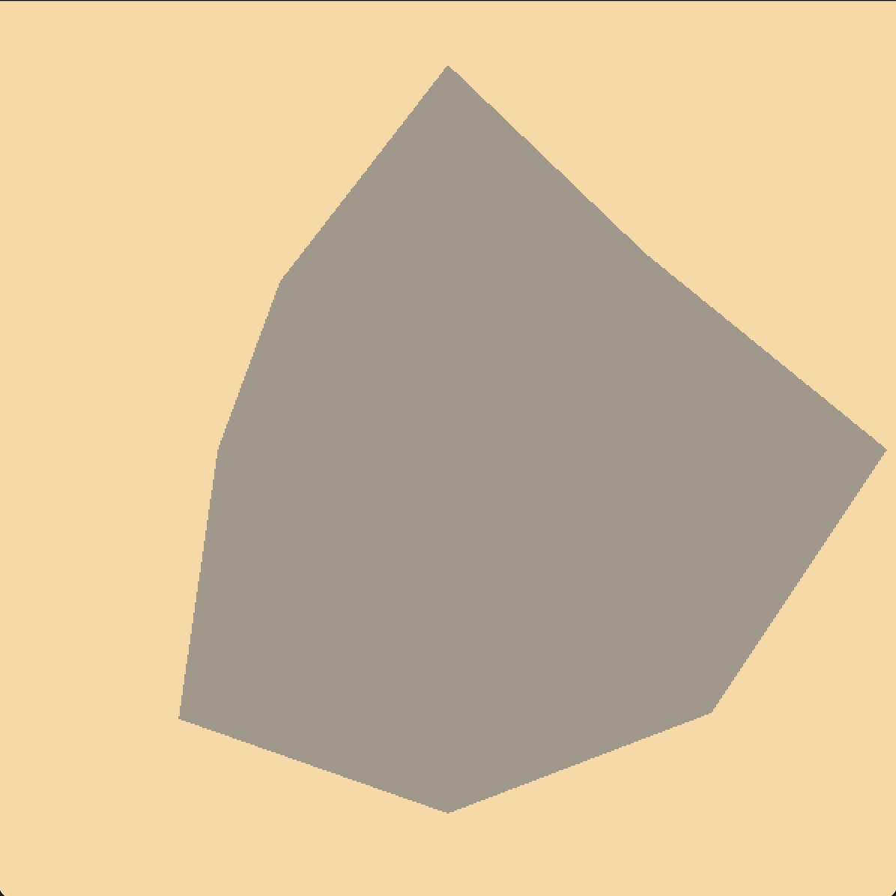

# COMP3170 Assignment 1  – Tank Adventure
## Topics covered:
* 2D mesh construction
* HSB and RGB colour spaces
* 2D transformations: rotation, translation, scale
* Animation
* Scene graph
* Coordinate frames
* 2D camera: view and projection matrices, aspect
* Instancing

## ULOs
* ULO1: Understand the fundamentals of vector geometry and employ them in devising algorithms to achieve a variety of graphic effects.
* ULO2: Program 2D and 3D graphical applications using OpenGL embedded in a programming language (such as OpenGL in Java).

## Task Description
Your task is to implement a top-down scene with a desert environment. Rocks and cacti litter the land (Figure 1). A tank rolls over the scene, controlled by the keyboard.

 

## Framework
For this assignment, you will need the COMP3170 LWJGL library that we have been using in the workshop classes. See the Week 1 workshop for instructions to download and install these library. Make sure to pull the latest version of the library from the repository before beginning the project.

This repo is the assignment. Inside this repo, you will find a Java project with the following files:
* `Assignment1.java` - The “bare-bones” driver class for the project.
* `Scene.java` – an example of a Scene class.
* `Tank.java` – an example of a class using the SceneObject class.
* `simple_vertex.glsl / simple_fragment.glsl` – a basic, simple shader.
To complete the assignment, you will need to edit these files and add further classes (and shaders) of your own.

## Features
You are required to complete each of the features below. Each features contributes a percentage towards your <b>Completeness</b> mark, as described below. Note that not all components are of equal difficulty.

Note: In the spec, some specific numbers (e.g. the colour and size of the tank, etc) are not specified. You are free to choose whatever values you feel appropriate for these as long as they illustrate the behaviour required. However, remember to use named constants in your code (with comments to indicate units) to allow these values to be easily modified. Clarity marks will be deducted for using ‘magic numbers’ (embedded numerical constants given without explanation). 

## General Requirements
You should use the SceneGraph implementation provided in the comp3170.lwjgl project to organise the objects in your scene.

Throughout this document, we will refer to “world units”. A world unit is defined as a single unit of world space. For example, an object with the following Model to World Matrix:

|i|j|k|T|
|-|-|-|-|
|2|0|0|2|
|0|2|0|3|
|0|0|1|0|
|0|0|0|1|

Is 2 world units in width and height, and positioned at coordinate (2,3) in world space. You can think of 1 world unit as equivalent to 1 metre.

### Cactus – Mesh (5%)
Create a cactus mesh with two branches. The cactus should be at least 1 world unit tall.


### Cacti field (5%)
Clear the background to a brownish, desert colour. Randomly position 1000 cacti throughout a 200 x 500 area of world units, as shown in Figure 5. Cacti should vary between 1 and 2 world units in height, with proportionate width.


### Rocky terrain (10%)
Randomly position 1000 rocks around the 200 x 500 area of world units.


Each rock is an irregular polygon with vertices lying on a circle of radius 1. The angle 𝜃 between successive vertices (measured at the centre of the circle) should always be less than 90 degrees.



### Rocks - Colour (5%)
Rock colour should be set to a hue of your choice, with a randomly chosen saturation and brightness value ranging from 0% to 100% in HSB space.


### Tank – Mesh (10%)
Create a mesh of a Tank with a hull (a colour of your choice, octagonal in shape), a turret (a colour of your choice, rectangular in shape) and a gun (colour of your choice, rectangular in shape). You may add more detail to this tank if you like, but remember to keep the basic shape legible for marking.


### Tank – Vertex colouring (5%)
Use vertex colouring to have the Tank components’ colouring changes across each mesh.


### Tank – Animation/Movement (5%)
The Tank can move forward in local space at a set speed when the `W` key is pressed. 

If the tank is moving forward, pressing the `A` key will rotate the tank at a set rate to the left in local space, and pressing `D` will rotate the tank at a set rate to the right in local space.

### Tank – Turret movement and gun scale (5%)
The turret can rotate 360 degrees left and right in local space. The gun can be scaled along its y axis to a minimum/maximum change of 3x of its original length. Rotation and scaling adhere to the following keyboard input:

|Input|Action|
|-|-|
|Up arrow | Increase gun length |
|Down arrow | Decrease gun length |
|Left arrow | Rotate turret left |
| Right arrow | Rotate turret right |

<video src="ExampleImages/tankmovement.mov" width="320" height="240" controls></video>

### World camera (5%)
Create a camera that follows the tank. The camera remains stationary, except for if the tank's mesh reaches the top or bottom quarters of the view, in which case the camera should move with it. The camera should remain aligned with the world X/Y coordinates and should not rotate.

## World camera – resizing (10%)
The view volume of the camera should be adjusted proportional to the size of the window, with scaling along the x axis. 

A 600x600 window should show a 30x30 area of world space. Making the window’s height larger (or shorter) should reveal more (or less) of the world without changing the screen size of objects displayed. Making the window wider (or narrower) should scale objects.


### Turret camera (5%)
Another camera, which is 3x as zoomed in as the main camera, follows the tank’s turret. This camera rotates to orient itself around the turret's z-axis, and moves to keep the turret in its centre. It adheres to the same scaling rules as the world camera.

Pressing '2' switches the current view to the turret camera. Pressing '1' switches back to the world camera.

## Distinction and HD level tasks
The above tasks are enough for you to earn a Credit (with credit-level effort/skill applied). The below tasks are more challenging, and should only be attempted by students aiming for Distinction and HD marks. We recommend completing the above tasks first before attempting these.

### Instancing (10%)
Implement the cacti using instancing so all the cacti are drawn in a single draw call.

### Tread marks (10%)
As the tank moves across the field, it leaves tread marks behind it that show its movement. The tread marks are black, and are shown as simple lines.


### Cacti colour bands (10%)
The cacti feature bands of another shade running along its length.

 

### Documentation
In addition to your code, you should complete the `Report.md` file found at the top level of this repo, addressing all questions. Images can be placed in the 'ReportImages' folder, also located at the top level of this repo. See `Report.md` for a description of each of these tasks.

Please use a ruler when drawing, and ensure your drawings are clear. Marks may be deducted for messy or unclear drawings.

## Submission
To submit your assignment, you must push this repo with your complete Java project and Report. When you have completed your project, label your final commit `Final Submission` so we know your project is ready to mark. Late submissions will be marked in accordance with the late assessment policy as outlined in the Unit Guide.

To allow us to best evaluate your project, practice good version control habits of regular commits with clear and meaningful commit messages.

## Grading
Your marks will be calculated using three components (according to the rubric below):
* Correctness: Whether your code is correctly implemented.
* Clarity: Whether your code is easy to understand.
* Documentation: Whether your report contains all the required elements.

This mark will be averaged with your Completeness mark, which refers to the total value of the components you have attempted. Each component is worth between 5% and 10%, as detailed above and in `Report.md`.

Your final mark will be determined using the following formula:


```
AVERAGE(Completeness, SUM(Correctness * 60% + Clarity * 20% + Documentation* 20%))
```

So, for example if you attempt 80% of the features above, with perfect correctness (100%), slightly sloppy code (70%) and some minor sloppiness in the document (80%), your final mark would be: 

```
AVERAGE (80% * (60% * 100% + 20% * 70% + 20% * 80%))
AVERAGE(80% * (60% + 14% + 16%))
AVERAGE(80% * 90%) 
= 85%
```

On the other hand, if you only attempt 50% of the features above, to the same level of quality (90%) your final mark would be: 

```
AVERAGE(50% * 90%) = 70%
```

### Rubric

|Criteria|Grade|Description|
|-|-|-|
|Correctness (60%)|HD (100)|Code is free from any apparent errors. Problems are solved in a suitable fashion. Contains no irrelevant code.|
||D (80)|Code has minor errors which do not significantly affect performance. Contains no irrelevant code.|
||CR (70)|Code has one or two minor errors that affect performance. Problems may be solved in ways that are convoluted or otherwise show lack of understanding. Contains some copied code that is not relevant to the problem.|
||P (60)|Code is functional but contains major flaws. Contains large passages of copied code that are not relevant to the problem.|
||F (0-40)|Code compiles and runs, but major elements are not functional.|
|Clarity (20%)|HD (100)|Good consistent style. Well structured & commented code. Appropriate division into classes and methods, to make implementation clear.|
||D (80)|Code is readable with no significant code-smell. Code architecture is adequate but could be improved.|
||CR (70)|Code is readable but has some code-smell that needs to be addressed. Code architecture is adequate but could be improved.|
||P (60)|Poor. Significant issues with code quality. Inconsistent application of style. Poor readability with code-smell issues. Code architecture could be improved.|
||F (0-40)|Significant issues with code quality. Inconsistent application of style. Poor readability with code-smell issues. Messy code architecture with significant encapsulation violations.|
|Documentation (20%)|HD (100)|All sections are complete and accurately represent the code. All diagrams are neat, clear, and well annotated.|
||D (80)|All sections attempted with minor sloppiness or missing detail. No discrepancies between documentation and code.|
||CR (70)|All sections attempted with minor sloppiness or missing detail. Minor discrepancies between documentation and code.|
||P (60)|All sections attempted with significant sloppiness and missing detail. Minor discrepancies between documentation and code.|
||F (0-40)|Some aspects incomplete. Diagrams unclear and badly drawn. Does not make use of graph paper. Coordinate systems not properly annotated. Major discrepancies between documentation and code.|

## Resources and Help
If you have any questions about the task, please post on the iLearn forums. Alternatively, you can email staff if the question is specific to your implementation.

### Colours
For help picking colours that go well together, using existing colour palettes found online can be a good place to start. [Color Hunt](https://colorhunt.co/) and [Coolor](https://coolors.co/) are both useful places to find palettes others have made. Alternatively, you use [Canva's Color Wheel](https://www.canva.com/colors/color-wheel/) to find colours that compliment one another and build your own palettes.

### Digital drawings
You may wish to use digital tools to create your drawings for documentation, and also to help you figure things out. We strongly recommend [Virtual Graph Paper](https://virtual-graph-paper.com/). Cam uses it in his lectures!
