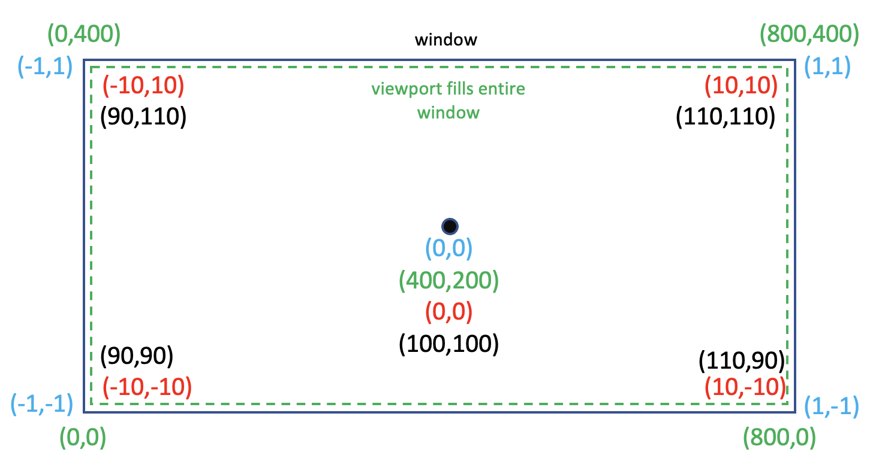

# COMP3170 Assignment 1 Report
### Student Name: [Your name here]
### Student ID: [Your ID here]

## Your Development Environment
|Spec|Answer|
|----|-----|
|Java JDK version used for compilation|-|
|Java compiler compliance level used for compilation|-|
|Java JRE version used for execution|-|
|Eclipse version|-|
|Your screen dimensions (width x height)|-|
|Your computer type (Mac/PC)|-|
|Your computer make and model|-|
|Your computer Operating System and version|-|

## Features Attempted
Complete the table below indicating the features you have attempted. This will be used as a guide by your marker for what elements to look for, and dictate your <b>Completeness</b> mark.

|Feature|Weighting|Attempted Y/N|
|-------|---------|-------------|
|Cactus mesh|5%|-|
|Cacti field|5%|-|
|Rocky terrain|10%|-|
|Rocky colouring|5%|-|
|Tank mesh|10%|-|
|Tank vertex colouring|5%|-|
|Tank transforms|5%|-|
|Turret and gun animation|5%|-|
|World camera |5%|-|
|World camera - resizing|10%|-|
|Turret camera|5%|-|
|Instancing|10%|-|
|Tread marks|10%|-|
|Cacti colour|10%|-|

## Scene Graph
Include a drawing (pen-and-paper or digital) of the scene graph used in your project.

## Mesh illustrations
Include illustrations of <b>all</b> the meshes used in your project, drawn to scale in model coordinates, including:
* The origin
* The X and Y axes
* The coordinates of each vertex
* The triangles that make the mesh

## World camera calculations
Include a diagram illustrating the world camera calculations, including:
* The viewport rectangle
* The mapping from view (camera centric) coordinates to NDC
* The mapping from NDC to viewport (pixel) coordinates

The diagram should follow the below format, but with values relevant to your project:

